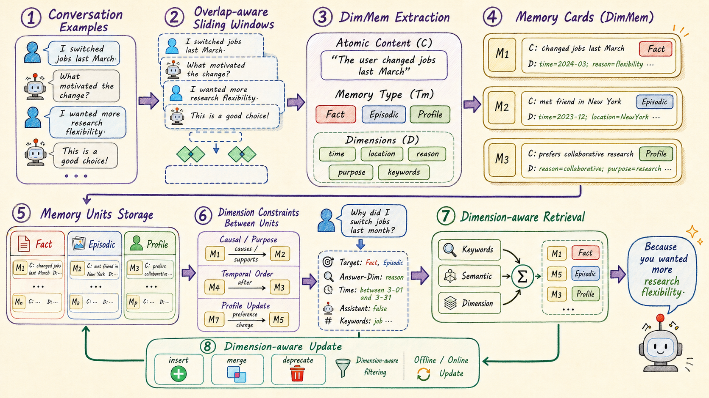

<p align="center">
  
</p>

<h1 align="center">DimMem</h1>

<p align="center">
  Dimensional Structuring for Efficient Long-Term Agent Memory
  <br>
  <a href="README_zh.md">中文版</a>
</p>

<p align="center">
  
</p>

## Features

- **Dimension Memory Model** — Each memory record carries structured fields (type, time, location, reason, purpose, keywords), enabling precise multi-dimensional retrieval
- **Three-Route Retrieval Fusion** — BM25 + dense embedding (MiniLM) + structured dimension matching, merged with content deduplication
- **7-Step Evaluation Pipeline** — Segmentation → Compression → Extraction → Query Analysis → Retrieval → QA → Judge
- **Dynamic Assistant Context** — Automatically determines whether to attach AI responses, saving ~89% context lookups
- **Dual Benchmark Support** — Full pipelines for both [LongMemEval](https://github.com/xiaowu0162/LongMemEval) and [LoCoMo](https://github.com/snap-stanford/LoCoMo)

## Quick Start

### Install

```bash
pip install -r requirements.txt
```

### Demo (no dataset needed)

```bash
python quick_start/quickstart_extract.py \
  --base-url http://localhost:7790/v1 \
  --model-name qwen3-30b-a3b \
  --demo both    # longmemeval / locomo / both
```

### Full Pipeline Test

```bash
# Edit API credentials first
bash quick_start/run_quickstart.sh
```

Runs the complete 7-step pipeline on one sample from each benchmark. Set `SKIP_COMPRESS=1` to skip the GPU-dependent compression step.

## Dataset Preparation

Download and place in `data/`:

| File | Source | Description |
|------|--------|-------------|
| `longmemeval_s_cleaned.json` | [LongMemEval](https://github.com/xiaowu0162/LongMemEval) | 500 QA records |
| `locomo10.json` | [LoCoMo](https://github.com/snap-stanford/LoCoMo) | 10 multi-turn conversations + QA |

## Full Pipeline

### Configuration

```bash
export BASE_URL="https://api.example.com/v1"
export API_KEY="your-api-key"
export MODEL="gpt-4.1-mini"
export EMBED_MODEL="/path/to/all-MiniLM-L6-v2"
```

> All LLM calls use `requests.post` to the OpenAI-compatible `/chat/completions` endpoint directly — no OpenAI SDK dependency.

---

### LongMemEval

#### Step 1: Segmentation

```bash
python longmemeval/segmenter/build_raw_segments.py \
  --input-path ./data/longmemeval_s_cleaned.json \
  --output-root ./results/segments/raw \
  --run-name my_run --window-size 15 --overlap 3
```

#### Step 2 (Optional): Compression

```bash
python longmemeval/compressor/build_compressed_segments.py \
  --raw-run-root ./results/segments/raw/my_run \
  --output-root ./results/segments/compressed \
  --run-name my_run --rate 0.8 --device-map cuda
```

> Requires GPU and `llmlingua` package.

#### Step 3: Memory Extraction

```bash
python longmemeval/memory_constructor/run_batch_extract.py \
  --segments-root ./results/segments/raw/my_run \
  --output-root ./results/memories --run-name my_run \
  --overlap 3 \
  --base-url $BASE_URL --api-key $API_KEY --model-name $MODEL
```

#### Step 4: Query Analysis

```bash
python longmemeval/query_parser/run_query_analysis.py \
  --input-root ./data/longmemeval_s_cleaned.json \
  --output-base ./results/query_analysis --run-name my_run \
  --base-url $BASE_URL --api-key $API_KEY --model-name $MODEL
```

#### Step 5: Retrieval

```bash
python longmemeval/search/retrieve_from_parsed_query.py \
  --query-parsed ./results/query_analysis/my_run/<question_type>/<sample_id>/parsed.json \
  --memory-dir ./results/memories/my_run/<question_type>/<sample_id> \
  --output-root ./results/retrieval/my_run \
  --top-k 15 --embedding-model $EMBED_MODEL
```

#### Steps 6+7: QA + Judge

```bash
python longmemeval/qa_judge/run_qa_judge_from_retrieval.py \
  --retrieval-root ./results/retrieval/my_run \
  --query-root ./results/query_analysis/my_run \
  --output-base ./results --run-name my_run \
  --base-url $BASE_URL --api-key $API_KEY --model-name $MODEL
```

#### Report

```bash
python longmemeval/qa_judge/run_report.py --judge-root ./results/judge/my_run
```

---

### LoCoMo

#### Step 1: Segmentation

```bash
python locomo/segmenter/build_raw_segments.py \
  --input-root ./data/locomo10.json \
  --output-root ./results/locomo_segments/raw \
  --run-name my_run --window-size 25 --overlap 5
```

#### Step 2 (Optional): Compression

```bash
python locomo/compressor/build_compressed_segments.py \
  --raw-run-root ./results/locomo_segments/raw/my_run \
  --output-root ./results/locomo_segments/compressed \
  --run-name my_run --rate 0.8 --device-map cuda
```

#### Step 3: Memory Extraction

```bash
python locomo/memory_constructor/run_batch_extract.py \
  --compressed-root ./results/locomo_segments/raw/my_run \
  --output-root ./results/locomo_memory --run-name my_run \
  --overlap 5 \
  --base-url $BASE_URL --api-key $API_KEY --model-name $MODEL
```

#### Step 4: Query Analysis

```bash
python locomo/query_parser/run_query_analysis_by_conv.py \
  --input-root ./data/locomo10.json \
  --output-base ./results/query_analysis --run-name locomo_my_run \
  --base-url $BASE_URL --api-key $API_KEY --model-name $MODEL \
  --exclude-categories 5
```

#### Step 5: Three-Route Retrieval

```bash
# BM25
python locomo/search/run_retrieval_bm25.py \
  --query-run-root ./results/query_analysis/locomo_my_run \
  --memory-root ./results/locomo_memory/my_run \
  --output-base ./results/retrieval/bm25 --run-name my_run --top-k 15

# Dense (MiniLM)
python locomo/search/run_retrieval_minilm.py \
  --query-run-root ./results/query_analysis/locomo_my_run \
  --memory-root ./results/locomo_memory/my_run \
  --output-base ./results/retrieval/minilm --run-name my_run --top-k 15 \
  --embedding-model $EMBED_MODEL

# Structured
python locomo/search/run_retrieval_from_query_analysis.py \
  --query-run-root ./results/query_analysis/locomo_my_run \
  --memory-root ./results/locomo_memory/my_run \
  --output-base ./results/retrieval/structured --run-name my_run --top-k 15
```

#### Step 6: QA Generation

```bash
python locomo/qa/run_qa_from_three_retrievals.py \
  --query-root ./results/query_analysis/locomo_my_run \
  --bm25-root ./results/retrieval/bm25/my_run \
  --minilm-root ./results/retrieval/minilm/my_run \
  --structured-root ./results/retrieval/structured/my_run \
  --output-base ./results/qa --run-name locomo_my_run \
  --top-n-each 15 \
  --base-url $BASE_URL --api-key $API_KEY --model-name $MODEL
```

#### Step 7: Judge

```bash
python locomo/judge/run_judge_from_qa.py \
  --qa-root ./results/qa/locomo_my_run \
  --conv-json ./data/locomo10.json \
  --output-base ./results/judge --run-name locomo_my_run \
  --base-url $BASE_URL --api-key $API_KEY --model-name $MODEL
```

---

### Memory Update (Optional)

Offline contradiction detection and record consolidation:

```bash
python longmemeval/update/run_update.py \
  --method dimmem \
  --memory-root ./results/memories/my_run \
  --dataset longmemeval \       # or locomo
  --output ./results/update_output/ \
  --base-url $BASE_URL --api-key $API_KEY --model-name $MODEL
```

## Project Structure

```
DimMem/
├── data/                   # Datasets (see Dataset Preparation)
├── quick_start/            # Demo & quickstart scripts
├── longmemeval/            # LongMemEval pipeline
│   ├── models/             #   DimensionMemory & ParsedQuery
│   ├── segmenter/          #   Step 1
│   ├── compressor/         #   Step 2
│   ├── memory_constructor/ #   Step 3
│   ├── query_parser/       #   Step 4
│   ├── search/             #   Step 5 (BM25 + embedding + structured + dedup)
│   ├── qa_judge/           #   Steps 6+7
│   └── update/             #   Memory update
├── locomo/                 # LoCoMo pipeline (same structure)
├── assets/                 # Logo & architecture diagram
└── requirements.txt
```

## Models

| Component | Model | Notes |
|-----------|-------|-------|
| Memory Extraction / Query Analysis | Qwen3-30B-A3B or gpt-4.1-mini | OpenAI-compatible API |
| Embedding | all-MiniLM-L6-v2 (384-dim) | Local, sentence-transformers |
| QA + Judge | gpt-4.1-mini | Any OpenAI-compatible model |
| Compression | LLMLingua-2 (bert-base-multilingual) | Local GPU |
